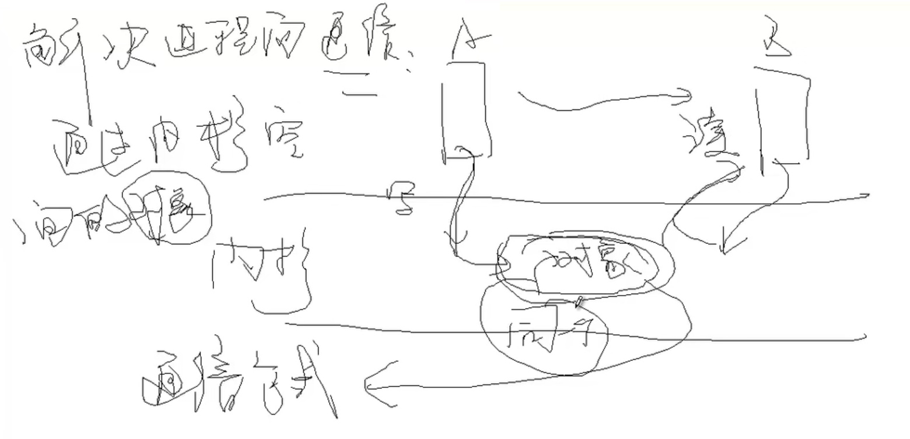
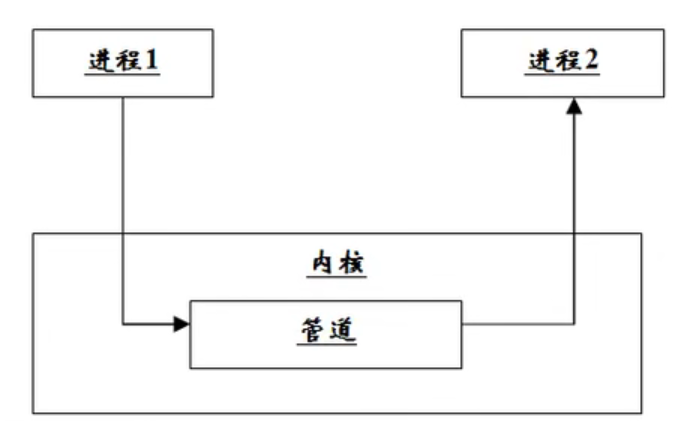
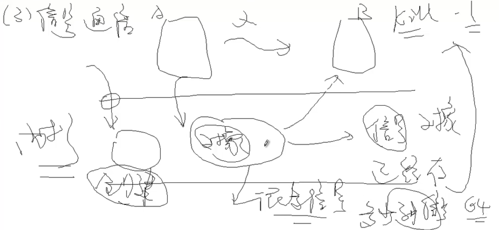
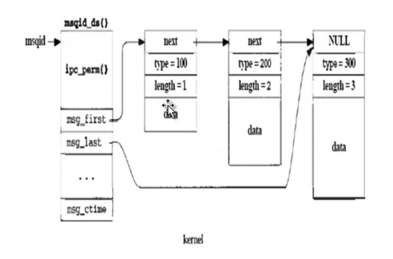

# 进程通信

### 一：进程通信概述

1. 什么是进程间通信？

   什么是线程间通信？
   进程间通信：在用户空间实现进程通信是不可能的([示例](00_fork_process/process.c))，通过Linux内核通信
   线程间通信：可以在用户空间就能实现，可以通过全局变量通信。[示例](01_pthread_communicate/process.c)
   
2. 有哪几种通信方式？

   管道通信：无名管道、有名管道（文件系统中有名）
   信号通信：信号（通知）通信包括：信号的发送、信号的接收和信号的处理。
   IPC(Inter-Process Communication) 通信：共享内存、消息队列和信号灯（信号量）.
   以上是单机模式下的进程通信（只有一个Linux内核）
   Socket通信：存在于一个网络中两个进程之间的通信（两个Linux内核）
3. 进程通信的学习思路：每一种通信方式都是基于文件IO的思想。

   open：功能：创建或打开进程通信对象。函数形式不一样，有的是有多个函数完成。
   write：功能：向进程通信对象中写入内容。函数形式可能不一样。
   read：功能：从进程通信对象中读取内容。函数形式可能不一样。
   close：功能：关闭或删除进程通信对象。形式可能不一样。

### 二：无名管道

通信原理：



管道文件是一个特殊的文件，是由队列来实现的。

在文件IO中创建一个普通文件或打开一个普通文件是由**open函数**来实现的，它**不能**创建管道文件。只能用pipe函数来创建管道。

函数形式：int open(const char *__path, int __oflag,mode_t mode)

功能：创建普通文件，为系统调用；unistd.h

参数：文件名，文件访问模式，文件访问权限

返回值：文件描述符

示例：int ret = open("file",O_CREAT,S_IRUSR | S_IWGRP);

说明：创建一个名为 file 的文件，该文件对文件属主可读，对文件所在组可写

函数形式：int pipe(int fd[2])

功能：创建管道，为系统调用；unistd.h

参数：就是得到的文件描述符。可见有两个文件描述符：fd[0]和fd[1]，管道有一个读端fd[0]用来读和一个写端fd[1]用来写，这个规定不能变。

返回值：成功是0，出错是-1；

extern ssize_t read (int__fd, void *__buf, size_t __nbytes) __wur;

| 说明     | 使用                                                                                                |
| -------- | --------------------------------------------------------------------------------------------------- |
| 头文件   | #include<unistd.h>                                                                                  |
| 函数形式 | long read (int__fd, void *__buf, size_t __nbytes) __wur                                             |
| 参数     | read NBYTES into BUF from FD.<br />fd：文件描述符<br />__buf：缓存指针<br />_nbytes：读取缓存字节数 |
| 返回值   | 成功：读取的字节数<br />失败：-1<br />0：结束                                                       |

extern ssize_t write (int__fd, const void *__buf, size_t __n) __wur;

| 说明     | 使用                                                                                             |
| -------- | ------------------------------------------------------------------------------------------------ |
| 头文件   | #include<unistd.h>                                                                               |
| 函数形式 | long write (int__fd, const void *__buf, size_t __n) __wur                                        |
| 参数     | Write N bytes of BUF to FD<br />fd：文件描述符<br />__buf：缓存指针<br />_nbytes：读取缓存字节数 |
| 返回值   | 成功：写入的字节数<br />失败：-1                                                                 |

[示例](02_anonymous_pipeline_communicate/pipe/process.c)

注意：

* 管道是创建在内存中的，进程结束，空间释放，管道就不存在了；
* 管道中的东西，读完了就删除了：队列；
* 如果管道中没有东西可读，则会阻塞；[读阻塞示例](02_anonymous_pipeline_communicate/read_block/process.c)  [写阻塞示例](02_anonymous_pipeline_communicate/write_block/process.c)

无名管道的缺点：不能实现不是父子进程（亲缘关系）之间的通信。[示例](02_anonymous_pipeline_communicate/parent_child/process.c)

### 三：有名管道

前置知识：linux文件类型

所谓的有名，即文件系统中存在这样一个的文件节点，每一个文件节点都有一个inode号而且这是一个特殊的文件类型：p管道类型。

1. 创建这个文件节点，不可以通过open函数，open函数只能创建普通文件，不能创建特殊文件
2. 管道文件只有inode号，不占磁盘空间，和套接字，字符设备文件，块设备文件一样。普通文件和符号链接文件及目录文件不仅有inode号，还占磁盘空间

| 文件类型标识 | 文件类型          | 创建方式 | 性质                              |
| ------------ | ----------------- | -------- | --------------------------------- |
| -            | 普通文件          | open     | 不仅有inode，还占磁盘空间         |
| d            | 目录文件          | mkdir    | 不仅有inode，还占磁盘空间         |
| l            | 符号链接文件      | ln -s    | 不仅有inode，还占磁盘空间         |
| s(伪文件)    | 套接字文件（s）   | socket   | 只有文件节点inode，不占磁盘IO空间 |
| b(伪文件)    | 块设备文件（b）   | mknod b  | 只有文件节点inode，不占磁盘IO空间 |
| c(伪文件)    | 字符设备文件（c） | mknod c  | 只有文件节点inode，不占磁盘IO空间 |
| p(伪文件)    | 管道文件（p）     | mkfifo   | 只有文件节点inode，不占磁盘IO空间 |

mkfifo

mkfifo：用来创建管道文件的节点，**没有在内核中创建管道**。

只有通过**open函数**打开这个文件时**才**会在**内核**空间**创建管道**。

函数形式：int mkfifo(const char* filename,mode_t mode);

功能：创建管道文件

参数：管道文件文件名，权限，创建的文件权限仍然和umask有关系。

返回值：创建成功返回0，创建失败返回-1。

作用：mkfifo [示例](03_filename_pipeline_communicate/filename_pipe/process.c)

通过有名管道可以实现无亲缘关系进程间通信。[示例first](03_filename_pipeline_communicate/filename_parent_child/first/process.c) [示例second](03_filename_pipeline_communicate/filename_parent_child/second/process.c)

### 四：信号通信

信号通信，其实就是内核向用户空间进程**发送信号**，只有**内核才能发信号**，用户空间进程不能发送信号。

前置知识：linux下进程的几种状态： 查看进程状态命令：ps -axj

| Linux进程状态                        | 标识                                      | 说明                                                                                                                                                                                                                                                                                                                                                                       |
| ------------------------------------ | ----------------------------------------- | -------------------------------------------------------------------------------------------------------------------------------------------------------------------------------------------------------------------------------------------------------------------------------------------------------------------------------------------------------------------------- |
| **可执行状态**                 | **R (TASK_RUNNING)**                | 可执行但尚未被CPU调度执行                                                                                                                                                                                                                                                                                                                                                  |
| **可中断的睡眠状态**           | **S (TASK_INTERRUPTIBLE)**          | 处于这个状态的进程因为等待某某事件的发生<br />（比如等待socket连接、等待信号量），而被挂起                                                                                                                                                                                                                                                                                 |
| **不可中断的睡眠状态**         | **D (TASK_UNINTERRUPTIBLE)**        | 进程处于睡眠状态，但是此刻进程是不可中断的<br />指的并不是CPU不响应外部硬件的中断，而是指进程不响应异步信号<br />TASK_UNINTERRUPTIBLE状态存在的意义就在于，<br />内核的某些处理流程是不能被打断的                                                                                                                                                                          |
| **暂停状态或跟踪状态**         | **T (TASK_STOPPED or TASK_TRACED)** | 表示进程暂停下来<br />向进程发送一个SIGCONT信号，<br />可以让其从TASK_STOPPED状态恢复到TASK_RUNNING状态<br />TASK_TRACED状态相当于在TASK_STOPPED之上多了一层保护，<br />处于TASK_TRACED状态的进程不能响应SIGCONT信号而被唤醒。<br />只能等到调试进程通过ptrace系统调用执行PTRACE_CONT、<br />PTRACE_DETACH等操作<br />或调试进程退出，被调试的进程才能恢复TASK_RUNNING状态 |
| **退出状态，进程成为僵尸进程** | **Z (TASK_DEAD - EXIT_ZOMBIE)**     | 退出过程中，进程占有的所有资源将被回收，<br />除了task_struct结构（以及少数资源）以外。<br />于是进程就只剩下task_struct这么个空壳，故称为僵尸                                                                                                                                                                                                                             |
| **退出状态，进程即将被销毁**   | **X (TASK_DEAD - EXIT_DEAD)**       | 进程将被置于EXIT_DEAD退出状态，<br />这意味着接下来的代码立即就会将该进程彻底释放<br />所以EXIT_DEAD状态是非常短暂的，几乎不可能通过ps命令捕捉到                                                                                                                                                                                                                           |

通过命令kill -l 可以查看到系统支持的64种信号

常用信号量及其含义：

| 信号名            | 含义                                                                                                                                   | 默认操作       |
| ----------------- | -------------------------------------------------------------------------------------------------------------------------------------- | -------------- |
| SIGHUP            | 该信号在用户终端连接（正常或非正常）结束时发出，<br />通常是在终端的控制进程结束时，通知同一会话内的<br />各个作业与控制终端不再关联。 | 终止           |
| SIGINT            | 该信号在用户键入INTR字符（通常是Ctrl-C）时发出，<br />终端驱动程序发送此信号并送到前台进程中的每一个<br />进程。                       | 终止           |
| SIGQUIT           | 该信号和SIGINT类似，但由QUIT字符（通常是Ctrl-\）<br />来控制                                                                           | 终止           |
| SIGILL            | 该信号在一个进程企图执行一条非法指令时（可执行<br />文件本身出现错误，或者企图执行数据段、堆栈溢出时）<br />发出。                     | 终止           |
| SIGFPE            | 该信号在发生致命的算术运算错误时发出。这里不仅<br />包括浮点运算错误，还包括溢出及除数为0等其它所有<br />的算术的错误                  | 终止           |
| **SIGKILL** | **该信号用来立即结束程序的运行，并且不能被阻塞、处理<br />和忽略。**                                                             | **终止** |
| **SIGALRM** | **该信号当一个定时器到时的时候发出**                                                                                             | **终止** |
| SIGSTOP           | 该信号用于暂停一个进程，且不能被阻塞、处理或忽略                                                                                       | 暂停进程       |
| SIGTSTP           | 该信号用于暂停交互进程，用户可键入SUSP字符（通常<br />是Ctrl-Z）发出这个信号。                                                         | 暂停进程       |
| SIGCHLD           | 子进程改变状态时，父进程会收到这个信号                                                                                                 | 忽略           |
| SIGABORT          | 该信号用于结束进程                                                                                                                     | 终止           |

常用的命令 kill 9 pid 是使用编号为9的信号SIGKILL 发送信号指令杀死一个进程



##### 信号通信的框架

* 信号的发送（发送信号进程）：kill raise alarm
* 信号的接收（接收信号进程）：pause() sleep() while(1)
* 信号的处理（处理信号进程）：signal

##### 信号的发送（发送信号进程）

**kill**

| 说明       | 使用                                                                                                                                                             |
| ---------- | ---------------------------------------------------------------------------------------------------------------------------------------------------------------- |
| 所需头文件 | #include `<signal.h>` <br />#include `<sys/types.h>`                                                                                                         |
| 函数原型   | int kill(pid_t pid,int sig);                                                                                                                                     |
| 函数传参   | pid : 正数：要接收信号的进程的进程号 0：信号被发送到所有和pid进程在同一个进程组的进程  -1：信号发给所有的进程表中的进程（除了进程号最大的进程外）<br />sig：信号 |
| 函数返回值 | 成功：0<br />   出错：-1                                                                                                                                         |

**raise：发信号给自己 == kill (getpid(),sig)**

[示例](04_signal_communicate/raise/raise.c)  [进程状态转换示例](04_signal_communicate/raise-parent-child/raise.c)

| 说明       | 使用                                                     |
| ---------- | -------------------------------------------------------- |
| 所需头文件 | #include `<signal.h>` <br />#include `<sys/types.h>` |
| 函数原型   | int raise(int sig);                                      |
| 函数传入值 | sig 信号                                                 |
| 函数返回值 | 成功：0 出错：-1                                         |

**alarm：发送闹钟信号的函数  只能发闹钟信号给当前进程**

alarm系统调用内核，内核在指定时间内发送SIGALRM信号给当前进程，进程终止。

[示例](04_signal_communicate/alarm/alarm.c)

| 说明       | 使用                                                                                                                 |
| ---------- | -------------------------------------------------------------------------------------------------------------------- |
| 所需头文件 | #include `<unistd.h>`                                                                                              |
| 函数原型   | unsigned int alarm(unsigned int seconds)                                                                             |
| 函数传入值 | seconds：指定秒数                                                                                                    |
| 函数返回值 | 成功：如果调用此alarm()前，进程中已经设置了闹钟时间，则<br />返回上一个闹钟时间的剩余时间，否则返回0。<br />出错：-1 |

##### 信号的接收（接收信号进程）

接收信号的进程，要有什么条件：要想使接收的进程能收到信号，这个进程不能结束：

while(1)

sleep

pause：进程状态为 S，如果不打断会一直处于睡眠状态与sleep（有时间）类似  [示例](04_signal_communicate/pause/pause.c)

| 说明       | 使用                    |
| ---------- | ----------------------- |
| 所需头文件 | #include `<unistd.h>` |
| 函数原型   | int pause(void);        |
| 函数返回值 | 成功：0；<br />出错：-1 |

##### 信号的处理（处理信号进程）

1、系统处理信号方式

A：忽略

B：终止进程

C：暂停进程

2、自己处理方式

自己处理信号的方法告诉内核， 这样你的进程收到了这个信号就会采用你自己的处理方式 [示例](04_signal_communicate/signal/self/signal.c)

signal

| 说明       | 使用                                                                                                                      |
| ---------- | ------------------------------------------------------------------------------------------------------------------------- |
| 所需头文件 | #include `<signal.h>`                                                                                                   |
| 函数原型   | signal(int signum,void (*handler)(int))) ;                                                                                |
| 函数传入值 | signum：指定信号<br />handler：SIG_IGN：忽略该信号；<br />SIG_DFL：采用系统默认方式处理信号<br />自定义的信号处理函数指针 |
| 函数返回值 | 成功：设置之前的信号处理方式<br />出错：-1                                                                                |

signal忽略信号处理 [示例](04_signal_communicate/signal/default/signal.c)

signal处理父子进程通信 [示例](04_signal_communicate/signal/parent-child/signal.c)

## IPC通信（Inter-Process Communication）

IPC和文件I/O函数的比较

| 文件I/O         | IPC                                        |
| --------------- | ------------------------------------------ |
| open            | msg_get<br />shm_get<br />sem_get          |
| read<br />write | msgsnd msgrecv<br />shmat shmdt<br />semop |
| close           | msgctl<br />shmctl<br />semctl             |

ftok：创建IPC对象的key值  （默认使用 宏 IPC_PRIVATE是 只能实现带亲缘关系间进程的IPC通信）

| 说明     | 使用                                                                           |
| -------- | ------------------------------------------------------------------------------ |
| 函数原型 | char ftok(const char* path,char key)                                           |
| 函数参数 | 第一个参数：文件路径和文件名(需要提前创建)，否则报错<br />第二个参数：一个字符 |
| 返回值   | 正确：返回一个key值<br />错误：返回-1                                          |

查看IPC对象 -m 共享内存 -q 消息队列 -s 信号灯

```shell
ipcs -m | -q | -s
```

删除IPC对象

```shell
ipcrm -m | -q | -s  id
```

### 五：共享内存(IPC)

打开或创建一个共享内存对象，共享内核在内核是什么样子的？

一块缓存，类似于用户空间的数组或malloc函数分配的空间一样

1）shmget 创建或打开一块共享内存

| 说明       | 使用                                                                                                            |
| ---------- | --------------------------------------------------------------------------------------------------------------- |
| 所需头文件 | #include `<sys/types.h>`<br />#include `<sys/ipc.h>`<br />#include `<sys/shm.h>`                          |
| 函数原型   | int shmget(Key_t key,int size,int shmflg);                                                                      |
| 函数参数   | key：IPC_PRIVATE 或 ftok的返回值<br />size：共享内存区大小<br />shmflg：同open函数的权限位，也可以用8进制表示法 |
| 函数返回   | 成功：共享内存段标识符——ID--文件描述符                                                                        |

2）shmat 将共享内存映射到用户空间中

能不能用read，write呢？

为了方便用户空间对共享内存的操作，使用地址映射的方式

| 说明     | 使用                                                                                                                                       |
| -------- | ------------------------------------------------------------------------------------------------------------------------------------------ |
| 函数原型 | void *shmat(int shmid,const void *shmaddr,int shmflg);                                                                                     |
| 函数参数 | shmid：ID号<br />const void* ：映射到的地址，NULL为系统自动完成的映射<br />shmflg ：SHM_RDONLY 共享内存只读；默认是0，表示共享内存可读写。 |
| 返回值   | 成功：映射后的地址<br />失败：NULL                                                                                                         |

3）shmdt：将进程里的地址映射删除 ，注意这里只是删除映射，并没有删除内核中的共享内存对象（通过ipcrm -m 删除）

| 说明     | 使用                           |
| -------- | ------------------------------ |
| 函数原型 | int shmdt(const void* shmaddr) |
| 函数参数 | shmaddr：共享内存映射后的地址  |
| 返回值   | 成功：0<br />失败：-1          |

[示例](05_ipc_share_mem_communicate/share-mem/share-mem.c)

4）shmctl：删除共享内存对象。（删除的是内核中的share memory）

| 说明       | 使用                                                                                                                                                                |
| ---------- | ------------------------------------------------------------------------------------------------------------------------------------------------------------------- |
| 函数原型   | int shmctl(int shmid,int cmd,struct shmid_ds * buf);                                                                                                                |
| 函数参数   | shmid：要操作的共享内存标识符。<br />cmd：IPC_STAT（获取对象属性）；IPC_SET（设置对象属性）；IPC_RMID（删除对象）<br />buf：指定IPC_STAT/IPC_SET时用以保存/设置属性 |
| 函数返回值 | 成功：0<br />出错：-1                                                                                                                                               |

[自实现my-ipcrm](05_ipc_share_mem_communicate/my-ipcrm/share-mem.c)  [自实现my-ipcs](05_ipc_share_mem_communicate/my-ipcs/share-mem.c)

共享内存特点：

共享内存创建之后，一直存在于内核中，知道被删除或系统关闭；

共享内存和管道不一样，读取后，内容仍在其共享内存中。

[共享内存父子进程通信示例](05_ipc_share_mem_communicate/share-mem-parent-child/share-mem.c)

共享内存非亲缘关系进程通信：[客户端进程示例（读）](05_ipc_share_mem_communicate/share-mem-non-parent-child/share-mem-client.c)、[服务器进程示例（写）](05_ipc_share_mem_communicate/share-mem-non-parent-child/share-mem-server.c)

### 六：消息队列(IPC)

IPC队列是一种 链式队列

msgid_ds 内核维护消息队列的结构体，队列的第一个消息指针msg_first，最后一个消息指针msg_last。消息中有一个成员指针next。

每一个消息中包含有哪些内容：

Data 数据

Length 数据的长度

Type 数据的类型



**消息的接收端可以根据消息的类型来接收 (与管道的区别)**

1）msgget  创建消息队列

| 说明       | 使用                                                                                   |
| ---------- | -------------------------------------------------------------------------------------- |
| 头文件     | #include `<sys/types.h>`<br />#include `<sys/ipc.h>`<br />#include `<sys/msg.h>` |
| 函数原型   | int msgget(key_t key,int flag);                                                        |
| 函数参数   | key：和消息队列关联的key值<br />flag：消息队列的访问权限                               |
| 函数返回值 | 成功：消息队列ID<br />出错：-1                                                         |

2）msgsnd  发送消息队列

| 说明       | 使用                                                                                                                                                                                                                                                                                            |
| ---------- | ----------------------------------------------------------------------------------------------------------------------------------------------------------------------------------------------------------------------------------------------------------------------------------------------- |
| 头文件     | #include `<sys/types.h>`<br />#include `<sys/ipc.h>`<br />#include `<sys/msg.h>`                                                                                                                                                                                                          |
| 函数原型   | int msgsnd(int msgid,const void* msgp,size_t size,int flag);                                                                                                                                                                                                                                    |
| 函数参数   | msgid：消息队列ID<br />msgp：指向消息的指针。常用消息结构msgbuf如下：<br />struct msgbuf{}<br />  long mtype;   //消息类型<br />  char mtext[N];  //消息正文<br />}<br />size：发送的消息正文的字节数<br />flag：IPC_NOWAIT  消息没有发送完成函数也会立即返回；0 ：直到发送完成函数才返回 |
| 函数返回值 | 成功：0<br />出错：-1                                                                                                                                                                                                                                                                           |

3）msgrcv 接收消息队列中的消息

| 说明       | 使用                                                                                                                                                                                                                                                                                                                                                                  |
| ---------- | --------------------------------------------------------------------------------------------------------------------------------------------------------------------------------------------------------------------------------------------------------------------------------------------------------------------------------------------------------------------- |
| 头文件     | #include `<sys/types.h>`<br />#include `<sys/ipc.h>`<br />#include `<sys/msg.h>`                                                                                                                                                                                                                                                                                |
| 函数原型   | int msgrcv(int msgid,void* msgp,size_t size,long msgtype,int flag);                                                                                                                                                                                                                                                                                                   |
| 函数参数   | msgid：消息队列ID<br />msgp：接收消息的缓冲区<br />size：要接收的消息的字节数<br />msgtype：0：接收消息队列中的第一个消息；<br />大于0：接收消息队列中第一个类型为msgtype的消息；<br />小于0：接收消息队列中类型值不大于msgtype的绝对值且类型值又最小的消息；<br />flag：0：若无消息函数会一直阻塞<br />          IPC_NOWAIT：若没有消息，进程会立即返回ENOMSG。 |
| 函数返回值 | 成功：接收到消息的长度<br />出错：-1                                                                                                                                                                                                                                                                                                                                  |

4）msgctl 删除消息队列

| 说明       | 使用                                                                                                                                                                                 |
| ---------- | ------------------------------------------------------------------------------------------------------------------------------------------------------------------------------------ |
| 头文件     | #include `<sys/types.h>`<br />#include `<sys/ipc.h>`<br />#include `<sys/msg.h>`                                                                                               |
| 函数原型   | int msgctl(int msgqid,int cmd,struct msgid_ds* buf);                                                                                                                                 |
| 函数参数   | msgid：消息队列的队列ID<br />cmd：IPC_STAT（获取对象属性，并将其保存在buf指向的缓存区中）；IPC_SET（设置对象属性。这个值取自buf参数）；IPC_RMID（删除对象）<br />buf：消息队列缓冲区 |
| 函数返回值 | 成功：0<br />错误：-1                                                                                                                                                                |

[消息队列基本操作示例](06_ipc_queue_communicate/message-queue/message-queue.c)

IPC消息队列单向通信 ：[客户端](06_ipc_queue_communicate/message-queue-one-way/mq-client.c)、[服务端](06_ipc_queue_communicate/message-queue-one-way/mq-server.c)

IPC消息队列双向通信（利用消息type和fork）：[客户端](06_ipc_queue_communicate/message-queue-two-way/mq-fork-client.c)、[服务端](06_ipc_queue_communicate/message-queue-two-way/mq-fork-server.c)

IPC消息队列特点：可以完成创建一个IPC msg对象，通过消息数据类型来完成 针对同一个消息队列进行双向通信。而共享内存和有名管道如果只创建一个内核对象的话只能实现单向通信

### 七：信号灯（IPC 信号量）

信号灯集合（可以包含多个信号灯） IPC对象是一个信号灯集（多个信号量），这点不同于pthread里面的semaphore

所有的函数是对一个集合的操作：

int semget(key_t key,int nsems,int semflg);

| 说明       | 使用                                                                                              |
| ---------- | ------------------------------------------------------------------------------------------------- |
| 所需头文件 | #include `<sys/types.h>`<br />#include `<sys/ipc.h>`<br />#include `<sys/sem.h>`            |
| 函数原型   | int semget(key_t key,int nsems,int semflg)                                                        |
| 函数参数   | key：和信号灯集关联的key值<br />nsems：信号灯集中包含的信号灯数目<br />semflg：信号灯集的访问权限 |
| 函数返回值 | 成功：信号灯集ID<br />出错：-1                                                                    |

int semctl(int semid,int semnum,int cmd, ...union semun arg(不是地址));

| 说明       | 使用                                                                                                                                               |
| ---------- | -------------------------------------------------------------------------------------------------------------------------------------------------- |
| 所需头文件 | #include `<sys/types.h>`<br />#include `<sys/ipc.h>`<br />#include `<sys/sem.h>`                                                             |
| 函数原型   | int semctl(int semid,int semnum,int cmd, ...union semun arg(不是地址)));                                                                           |
| 函数参数   | semid：信号灯集ID<br />semnum：要修改的信号灯编号<br />cmd：GETVAL（获取信号灯的值）、SETVAL（设置信号灯的值）、IPC_RMID（从系统中删除信号灯集合） |
| 函数返回值 | 成功：0<br />出错：-1                                                                                                                              |

```c
union semun{
    int val;  //SETVAL : 设置信号灯的值
    struct semid_ds *buf;
              //IPC_STAT (获取对象属性)
              //IPC_SET（设置对象属性）
    unsigned short * array; //
    struct seminfo *__buf;  //Buffer for IPC
}
```

[IPC信号量集示例](07_ipc_semaphore_communicate/semaphore-set/semaphore-set.c)

int semop(int semid,struct sembuf *opsptr, size_t nops);

[POSIX pthread信号量同步示例](07_ipc_semaphore_communicate/pthread-semaphore/thread.c)

int semop(int semid,struct sembuf *opsptr, size_t nops);

| 说明       | 使用                                                                                                                                                                                                                                                                                                        |
| ---------- | ----------------------------------------------------------------------------------------------------------------------------------------------------------------------------------------------------------------------------------------------------------------------------------------------------------- |
| 所需头文件 | #include `<sys/types.h>`<br />#include `<sys/ipc.h>`<br />#include `<sys/sem.h>`                                                                                                                                                                                                                      |
| 函数原型   | int semop(int semid,struct sembuf *opsptr, size_t nops);                                                                                                                                                                                                                                                    |
| 函数参数   | semid：信号灯集ID<br />struct sembuf{<br />   short sem_num; //要操作的信号灯的编号<br />   short sem_op;  //0：等待，直到信号灯的值变为0 <br />   //1：释放资源，V操作<br />   //-1：分配资源，P操作<br />   short sem_flg;  //0，IPC_NOWAIT，SEM_UNDO<br />}<br />nops：要操作的信号灯的个数 |
| 函数返回值 | 成功：0<br />出错：-1                                                                                                                                                                                                                                                                                       |

[IPC信号灯集同步示例](07_ipc_semaphore_communicate/ipc-semaphore/semaphore.c)

IPC信号灯集通信 ： [server示例](07_ipc_semaphore_communicate/semaphore-communicate/server.c)  [client示例](07_ipc_semaphore_communicate/semaphore-communicate/client.c)
